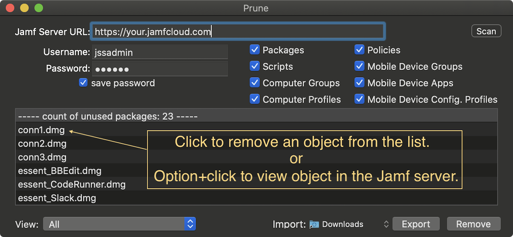

# Prune

As your Jamf server ages it often accumulates more and more unused items, such as outdated packages, unscoped policies, mobile device apps...  Use Prune to help identify and remove those unused items.

Download: [Prune](https://github.com/BIG-RAT/prune/releases/download/current/prune.zip)

Once the list of unused items is generated you can edit it within the app.  If you see an object you wish to keep, say some policy, simply click the item in the list.  The item will be removed from the list, and hence not removed from the server.  Perhaps you'd like to review the item on the server before deleting, not a problem, just option-click the item and you'll be taken to it on the Jamf server (may need to authenticate first).

#### Usage:
* Enter the server URL you wish to query along with valid credentials.  To simply generate a list you can use an auditor account.  To remove items an account with delete permissions is required.
* Select the items you'd like to scan.  You can option-click to select/de-select all the categories; packages, scripts, computer groups...
* Click Scan.
* Once the processing is complete review/edit the list.
* Click Remove if you wish to remove the items from the server.
* Click Export if you wish to save (to your Downloads folder) the lists of objects to remove for review/editing later.  These lists can then be imported into the application.

#### Important:
This application deletes stuff, use with caution!  It is recommended you have a valid backup before deleting any objects.  You could either perform a database backup (if on prem) or use [Jamf Migrator](https://github.com/jamf/JamfMigrator) and export the (full) XML of all objects, or do both.
