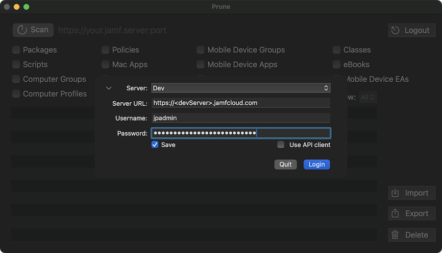

# Prune

   
   

## What is Prune?

**Prune** is a macOS application that helps you clean up your Jamf Pro server by identifying and removing unused items. As your Jamf server ages, it often accumulates outdated packages, unscoped policies, mobile device apps, and other unused objects. Prune scans your server to find these items and helps you safely remove them.

### Quick Download

👉 **[Download Prune (Latest Release)](https://github.com/BIG-RAT/prune/releases/latest/download/prune.zip)**

---



## How It Works

1. **Scan**: Prune connects to your Jamf Pro server and scans for unused items across multiple object types.
2. **Review**: The app generates a list of potentially unused items that you can review and edit.
3. **Edit**: Remove items from the deletion list or open them directly on your Jamf server.
4. **Delete**: Once you're confident, delete the unused items to clean up your server.

> **⚠️ Error Handling**: If the server indicates an error while reading an object, it will be logged and you'll receive an alert indicating the results may be inaccurate.


### Editing Your List

Once the list of unused items is generated, you can edit it directly within the app:

- **Remove an item from the deletion list**: Option-click the item to keep it (it won't be deleted from the server)
- **Review an item on the server**: Double-click any item to open it directly on your Jamf server (you may need to authenticate first)


## 📖 Usage Guide

### Step-by-Step Instructions

1. **Connect to Your Server**
   - Enter your Jamf Pro server URL and credentials
        - **💡 Recommended**: Use [API Client Credentials](#setting-up-api-client-credentials) for authentication instead of user accounts
   - To generate a list only: Use an auditor account (read-only) or client credentials with read permissions
   - To delete items: Use an account with delete permissions or client credentials with delete permissions

2. **Select Object Types to Scan**
   - Choose the object types you want to scan (packages, scripts, computer groups, policies, etc.)
   - **Tip**: Option-click to select or deselect all object types at once

3. **Start the Scan**
   - Click the **Scan** button
   - Wait for Prune to analyze your server and identify unused items

4. **Review and Edit the Results**
   - Review the generated list of unused items
   - **Option-click** any item to remove it from the deletion list (keeps it on your server)
   - **Double-click** any item to open it on your Jamf server for detailed review

5. **Delete Items** (Optional)
   - Click **Delete** to remove the listed items from your server
   - To delete only a specific object type: Change the **View** option to the desired type, then click **Delete**

6. **Export Results** (Optional)
   - Click **Export** to save lists to your Downloads folder (one file per object type)
   - These files can be imported later by clicking the import button or dragging the file onto it
   - **Option-click Export** to export all items to a single CSV file

### ⚠️ Important Notes

- **Blueprints are not scanned**: Groups used only in blueprints will show as unused since blueprints aren't analyzed.

---

<a id="setting-up-api-client-credentials"></a>
## 🔑 Setting Up API Client Credentials

API Client Credentials are the recommended method for authenticating with your Jamf Pro server. They provide better security and are more suitable for programmatic access than user accounts.

### Step-by-Step Setup

1. **Log into Jamf Pro**
   - Open your Jamf Pro web interface
   - Sign in with an account that has administrative privileges

2. **Navigate to Client Credentials**
   - Go to **Settings** (⚙️)
   - Select **API roles and clients** from the System Settings section

3. **Create a New API Role**
   - Click the **New** button (+) to create a new API role
   - Fill in the required information:
     - **Display Name**: Enter a descriptive name (e.g., "Prune.app - Read & Delete Objects")
     - **Privileges**: Choose the appropriate privileges based on your needs:
       - **For read-only access** (scanning only): Grant Read permissions for all object types you want to scan
       - **For full functionality** (scanning and deleting): Grant both Read and Delete permissions for the object types you want to manage
   
   #### Complete List of Required Privileges for Full Functionality
   
   If you want to use Prune with all available object types, you'll need to grant the following privileges in your API role:
   
   | Object Type | Required Privileges |
   |------------|---------------------|
   | **Classes** | Read Classes, Delete Classes |
   | **Computer Extension Attributes (EAs)** | Read Computer Extension Attributes, Delete Computer Extension Attributes, Read Patch Software Titles |
   | **Computer Groups** | Read Smart Computer Groups, Delete Smart Computer Groups, Read Static Computer Groups, Delete Static Computer Groups |
   | **Computer Objects (General)** | Read Computer PreStage Enrollments |
   | **Computer Profiles** | Read macOS Configuration Profiles, Delete macOS Configuration Profiles |
   | **eBooks** | Read eBooks, Delete eBooks |
   | **Mac Apps** | Read Mac Applications, Delete Mac Applications |
   | **Mobile Device Apps** | Read Mobile Device Applications, Delete Mobile Device Applications |
   | **Mobile Device Configuration Profiles** | Read iOS Configuration Profiles, Delete iOS Configuration Profiles |
   | **Mobile Device Extension Attributes (EAs)** | Read Mobile Device Extension Attributes, Delete Mobile Device Extension Attributes |
   | **Mobile Device Groups** | Read Smart Mobile Device Groups, Delete Smart Mobile Device Groups, Read Static Mobile Device Groups, Delete Static Mobile Device Groups |
   | **Mobile Device Objects (General)** | Read Mobile Device PreStage Enrollments |
   | **Packages** | Read Packages, Delete Packages |
   | **Policies** | Read Policies, Delete Policies |
   | **Printers** | Read Printers, Delete Printers |
   | **Restricted Software** | Read Restricted Software, Delete Restricted Software |
   | **Scripts** | Read Scripts, Delete Scripts |
   
   > **Tip**: You can create separate API roles for different use cases (e.g., one for read-only scanning and one for full delete access) and assign them to different API clients as needed.
        

4. **Create a New API Client**
   - Navigate back to the **API roles and clients** section in Jamf Pro
   - On the **API Clients** tab, click the **New** button (+) to create a new API client
    - Fill in the required information:
        - **Display Name**: Enter a descriptive name (e.g., "Prune.app")
        - **API roles**: Select the API role you created in the previous step
    - Enable API client: Click the **Enable API client** button
    - Click **Save** to create the client

5. **Generate Client Secret and Copy Credentials**
   - Click **Generate client secret** > **Create secret**
   - **Important**: Copy the **Client ID** and **Client Secret** immediately
   - The Client Secret will only be displayed once and cannot be retrieved later
   - Store these credentials securely (consider using a password manager)

6. **Use in Prune**
   - When connecting in Prune, check the box for **Use API client**:
     - Paste your **Client ID** and **Client Secret** into the relevant fields

---

## 🔍 How Prune Determines Usage

Prune analyzes each object type by checking specific usage locations in your Jamf Pro server. The table below explains how each object type is evaluated:

| Object Type | How Usage is Determined |
|------------|------------------------|
| **Packages** | Checked for usage in policies, patch policies, and computer prestages |
| **Scripts** | Checked for usage in policies |
| **Computer Groups** | Checked for usage in policies, computer configuration profiles, computer groups, eBooks, restricted software, advanced searches, app installers, and enabled state |
| **Computer Profiles** | Checked for scope and usage in computer prestages |
| **Policies** | Checked for scope |
| **Printers** | Checked for usage in policies and macOS configuration profiles |
| **Mac Apps** | Checked for scope |
| **Restricted Software** | Checked for scope of computer groups |
| **Computer Extension Attributes** | Checked for scope of computer groups, advanced searches (including display tab), and enabled state |
| **eBooks** | Checked for scope |
| **Mobile Device Groups** | Checked for usage in mobile device apps, mobile device configuration profiles, mobile device groups, eBooks, and classes |
| **Mobile Device Profiles** | Checked for scope |
| **Classes** | Checked for scope (only looks for students/student groups/mobile device assignments) |
| **Mobile Device Extension Attributes** | Checked for scope of mobile device groups and advanced searches |

---

## ⚠️ Important Warnings

### 🔴 Use with Caution!

**This application deletes items from your Jamf Pro server. Always use with caution!**

1. **Backup First**: It's **strongly recommended** to have a valid backup before deleting any objects. You can:
   - Perform a database backup (if on-premise)
   - Use [Replicator](https://github.com/jamf/Replicator) to export the full XML of all objects
   - Or do both for maximum safety

### Known Limitations

Prune may identify some items as unused that are actually in use due to API limitations:

- **Policies scoped only to users/user groups**: Will show as unused because the API doesn't list users or user groups in policy scopes
- **Mac Apps**: Enabled/disabled state is not available via the API, so this isn't used to determine usage
- **Bookmarks**: Not accessible via the API, so groups used only to scope bookmarks will show as unused

### Logging

Logging information is written to:
```
~/Library/Containers/com.jamf.pse.prune/Data/Library/Logs/Prune.log
```

You can access this folder through the menu bar: **View → Logs Folder**

---

## 📊 Analytics & Privacy

Prune collects basic hardware, OS, and application usage data and sends it **anonymously** to [TelemetryDeck](https://telemetrydeck.com) to help improve the application. You can opt out at any time by clicking **"Opt out of analytics"** at the bottom of the **"About Prune"** window.
